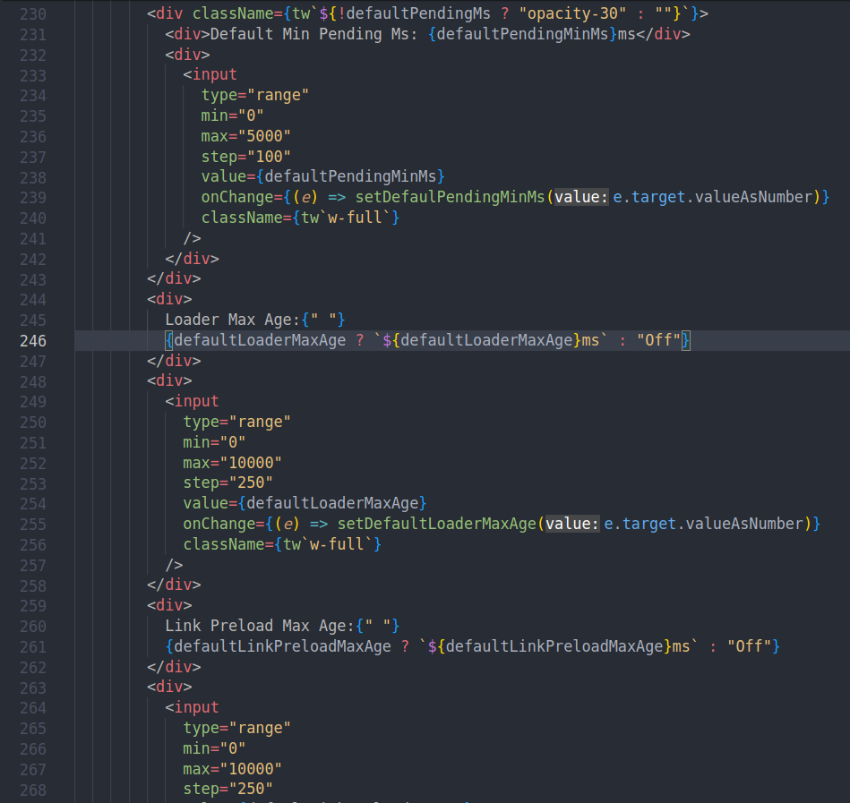
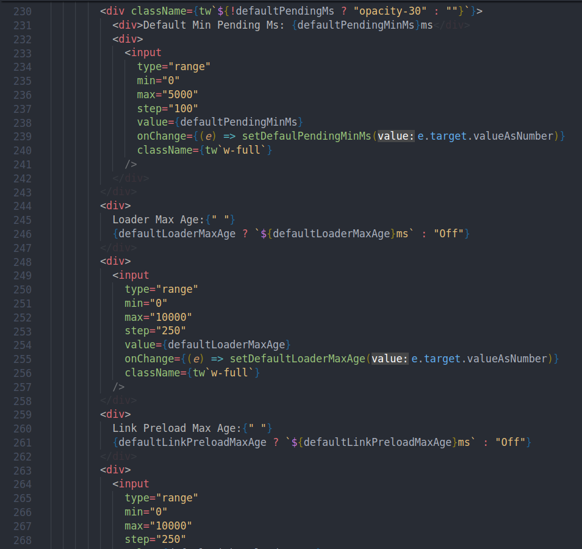
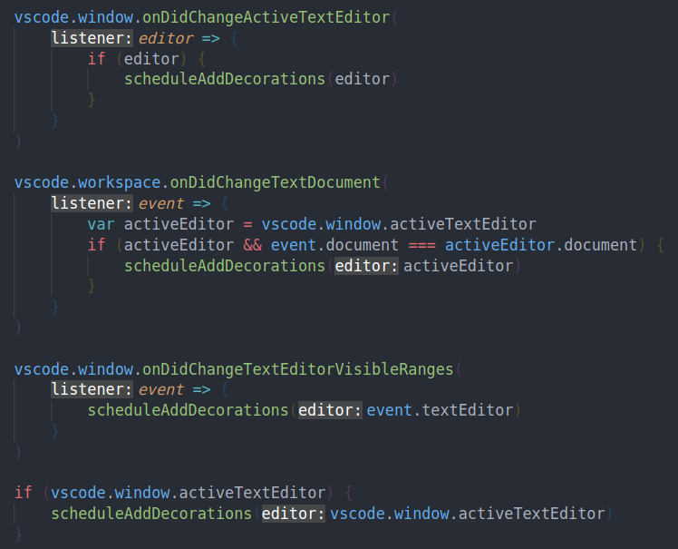
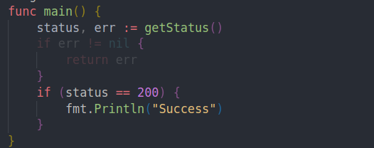

# lowlight-patterns

Our code is often littered with tokens and boilerplate that hinder readability.

However switching to another language/framework is often not practical due to political constraints or ecosystem dependencies.

This utility offers a ridiculously simple alternative - you can specify a few regex patterns and code matching those patterns will be dimmed out making them less intrusive.

## Examples:

Hate JSX closing tags ? Worry no more ...

```json
"lowlight-patterns.rules": [
    "</[^>]*>"
]
```

<table>
    <tr>
        <th>Before:</th>
        <th>After:</th>
    </tr>
    <tr>
        <td>
            
        </td>
        <td>
            
        </td>
    </tr>
<table>

Python developer ? All the extra punctuation in javascript makes your eyes bleed ? Here you go ...

```json
"lowlight-patterns.rules": [
    "(\\{|\\}|\\(|\\)|\\[|\\]|,|;|/>)"
]
```



It is possible to configure opacity at global level and rule level:

```json
"lowlight-patterns.opacity": 0.2,
"lowlight-patterns.rules": [
    {
        "start": "</[^>]+>",
        "opacity": 0.1
    },
    {
        "start": "(\\{|\\}|\\(|\\)|\\[|\\]|,|;|/>)",
        "opacity": 0.5
    }
]
```

:warning: **Experimental**

It is possible to define start and end pattern, to dim multi-line ranges:

```
"lowlight-patterns.rules": [
    {
      "start": "if\\s+err\\s+\\!\\=\\s+nil\\s+\\{",
      "end": "\\}"
    },
]
```



## License:

MIT

## Prior Art & Credits:

### [lengmoXXL/lowlight-block](https://github.com/lengmoXXL/lowlight-block)

This was the primary inspiration behind this extension. This does not appear to be currently maintained and does not work well for patterns like the closing tag example above.

Our implementation is also much more responsive for large files because we don't traverse full file content - only the visible range. We also support user configuration options for opacity at global level and rule level.

### Logo

Taken from https://www.svgrepo.com/svg/2896/desk-lamp (licensed CC0)